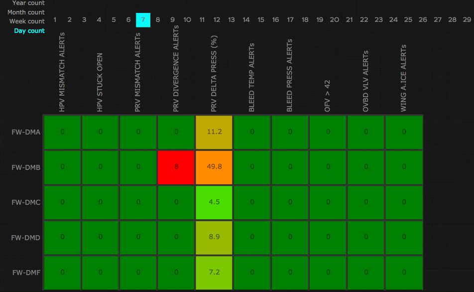
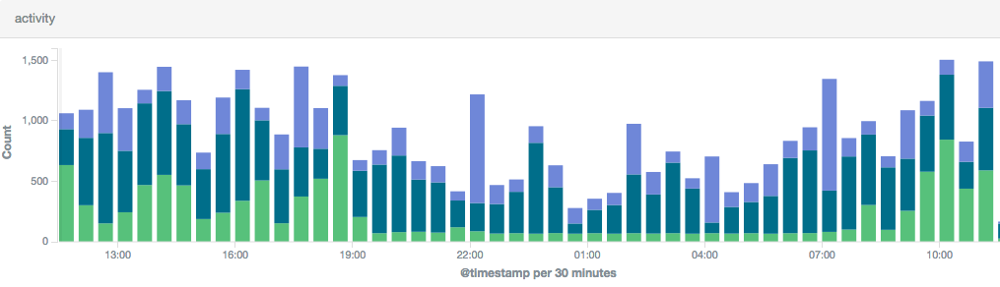
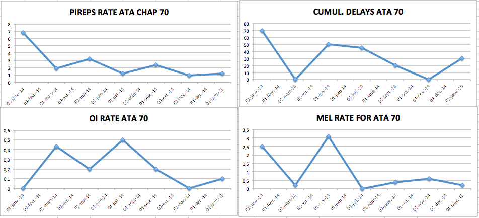
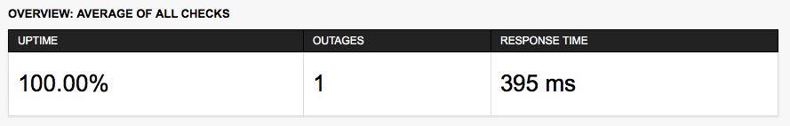
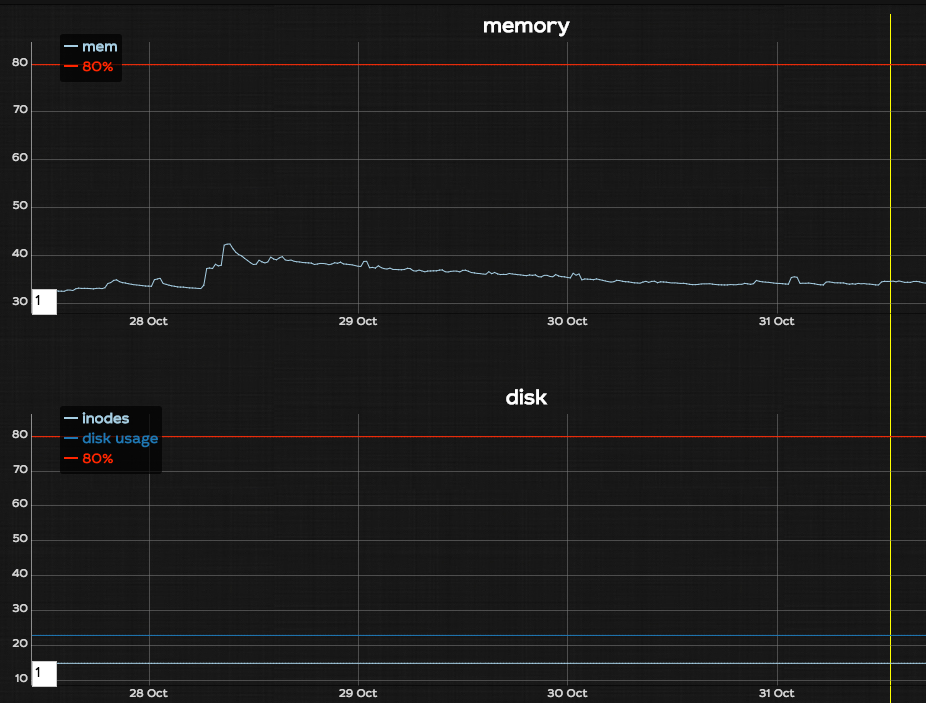

## WILCO metrics

This document provides, for information only, a set of examples of metrics that can be used to measure the performance of FlightWatching's health monitoring platform "WILCO". Some of these metrics can be generated by WILCO software platform licensee and other metrics can be provided by FlightWatching on request.
 
#### Monitoring metrics
- ATA Chapters covered by WILCO monitorings
- Number of alerts triggered by WILCO (see Figure 2)
- Number of monitorings set up
- Number of aircraft monitored
- Number of users registered(see Figure 3)

Figure 2 -  Example of number of alerts that triggered within a given period of time can be monitored with a MATRIX dashboard that can be configured by FlightWatching team

Figure 3 -  Example of number of users registered and corresponding activity.

 
#### MRO / Airline metrics
These metrics are generally provided by FlightWatching licensee (i.e. customer) because they usually involve their CAMO organisations 

- Number of alerts triggered by WILCO and confirmed on aircraft by maintenance 
- Number of PIREPs (Pilot Reports) per ATA chapter  
- Number of DELAYs per ATA chapter  
- MEL rate per ATA chapter 
- Number of AOGs per ATA chapter  
- Number of NFFs per ATA chapter  

 
#### Cloud service metrics
These metrics are processed by FlightWatching teams and are generally not published but can be requested on a case by case basis.

- Uptime availability of FlightWatching server (see Figure 4)
- Memory usage of FlightWatching server (see Figure 5)
- Disk usage of FlightWatching server (see Figure 5) 

Figure 4 -  Example of Metrics providing uptime performance of cloud server

Figure 5 -  Example of server metrics providing data on memory and disk usage 

As mentioned in WILCO T&C's : in no event will FlightWatching be liable to licensee for any loss, damages, claims or costs whatsoever including any consequential, indirect or incidental damages, any lost profits or lost savings, any damages resulting from business interruption, personnal injury or failure to meet any duty of care, or claims by a third party.

This document and all information contained herein is the sole property of FlightWatching SAS. No intellectual property rights are granted by the delivery of this document or the disclosure of its content. This document shall not be reproduced nor disclosed to a third party without the express written consent of FlightWatching SAS. This document and its content shall not be used for any purpose other than that for which it is supplied.
The statements made herein do not constitute an offer.
